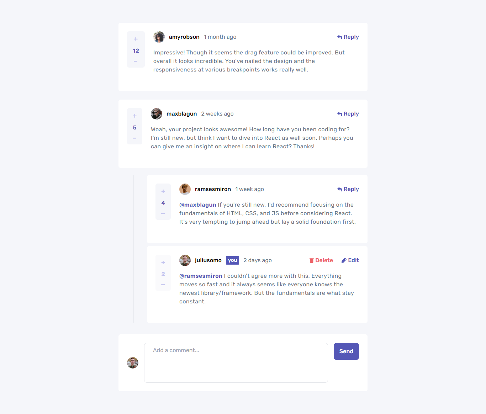

# Frontend Mentor - Interactive comments section solution

This is a solution to the [Interactive comments section challenge on Frontend Mentor](https://www.frontendmentor.io/challenges/interactive-comments-section-iG1RugEG9). Frontend Mentor challenges help you improve your coding skills by building realistic projects.

### The challenge

Users should be able to:

- View the optimal layout for the app depending on their device's screen size
- See hover states for all interactive elements on the page
- Create, Read, Update, and Delete comments and replies
- Upvote and downvote comments
- **Bonus**: If you're building a purely front-end project, use `localStorage` to save the current state in the browser that persists when the browser is refreshed.
- **Bonus**: Instead of using the `createdAt` strings from the `data.json` file, try using timestamps and dynamically track the time since the comment or reply was posted.

### Screenshot

### Links

- Solution URL: [FrontEnd Mentor solution](https://www.frontendmentor.io/solutions/interactive-comments-section-vite-react-typescript-recoil-NZaUsG42s)
- Live Site URL: [Live demo](https://interactive-comments-section-blond.vercel.app/)

## My process

### Built with

- Vite (Extremely fast module bundler)
- React JS (JavaScript UI library)
- TailwindCSS (for styling)
- Timeago React (for live-upating the time passed component library)
- Recoil (superb state management library for React)

## Author

- Website - [A.K. Afiq](https://my-portfolio-ashy-delta.vercel.app/)
- Frontend Mentor - [@yourusername](https://www.frontendmentor.io/profile/akaahl)
- Twitter - [@akaahl1](https://twitter.com/akaahl1)

## Acknowledgments

TThank you FrontEndMentor for creating this challenge.
